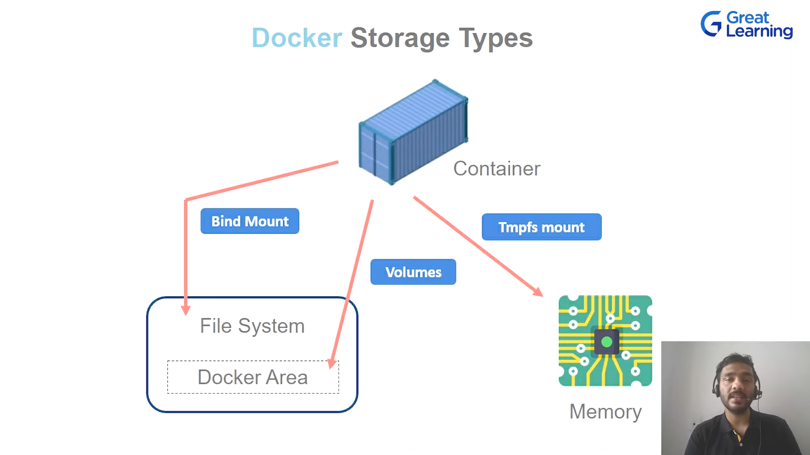

                Docker

# MIcrosystem & containerization - Docker

# Container
Containers are software that wrap up all the parts of a code and all its dependencies into a asingle deployable unit that can be used on different system and servers.

>> Multiple isolated container can be launched together to form micoservices which cab be easily managed using any orchestration tool eg. docker swarm, kubernetes  etc

## Container vs Vm
* container
1. container only the bare minmum parts of the os required to run the software updates are easy and simple to do.
2. this isolation provided by a container isn't as complete as of a VM but is adequate
3. container are self contained environments that can easily be used on different os 

* Vm
1. contains the complete os that is normally used on system for general purpose UPdates are time consuming and tough.
2. VM provides complete isolation from the concerning host system and is also more secure
3. Vms aren't that easily ported with the same settings from one os to another.


## Docker install

1. Install Docker CE
sudo apt update 
sudo apt install docker.io

sudo apt remove docker.io -y

docker --version

2. Set up the docker reposiitory
-> sudo apt-get / apt update

This command refreshes the list of available packages and versions on your system. It ensures you’re getting the latest versions of packages from your repositories.

-> sudo apt install apt-transport-https ca-certificates curl software-properties-common

This installs essential tools:

apt-transport-https allows using HTTPS to fetch packages.
ca-certificates manages certificates to enable secure communication.
curl helps transfer data from or to a server.
software-properties-common provides tools to manage software repositories.

-> curl --fsSl https://download.docker.com/linux/ubuntu/gpg | sudo apt add -
or
curl -fsSL https://download.docker.com/linux/ubuntu/gpg -o /usr/share/keyrings/docker-archive-keyring.gpg


This downloads Docker’s GPG key and adds it to your system to verify the packages you download from Docker. The key ensures that packages are authentic and haven’t been tampered with.


-> sudo add-apt-repository "deb [arch=amd64] https://download.docker.com/linux/ubuntu $(lsb_release -cs) stable"

--> sudo apt-get update 
--> sudo apt-get install docker-ce


## Docker environment
1. Docker engine 
2. Docker object
3. Docker registry
4. Docker compose
5. Docker swarm

### Docker engine 
Docker engine is as the name suggests, its technology that allows for the creation and management of all the docker processes. the has three major parts to it.

docker cli --> docker api --> docker daemon

### Docker object
1. docker images
2. docker containers
3. docker volumes
4. docker networks
5. docker swarm nodes & services

1. docker images
docker images are set of instructions that are used to create containers and execute code inside it

>> sudo docker pull ubuntu
>> sudo docker images
>> sudo docker run --it -d --name -p 80:80 container_name ubuntu( image_name )

3333:4444
The first 3333 (before the colon) is the port number on the host machine.
The second 4444 (after the colon) is the port number inside the container.

-it: For interactive use (access container shell).
-d: For running the container in the background.
>> sudo docker ps ( running container )
>> sudo docker ps -a ( to see all container )


--> to inside a container
>> docker exec -it container-name / container_id bash

--> linux command
>> service nginx status 
>> service nginx start

--> stop container
>> docker stop container_id

--> stop container forcefully
>> docker kill container_id

--> restart the contaier
>> docker restart container_id / container_name 

--> remove a container
>> docker rm container_id

--> remove a container forcefully 
>> docker rm  -f container_id

--> remove docker image
>> docker rmi image_id or name

--> create a new image with cuurent container state , to persisit the configuration
>> docker commit container new_image_name

### docker volumes
docker volumes are basically persistent storage locations for the containers. they can be easily & safely attached and removed from different container. And they are also portable from system to another 

volumes drivers allow you to perform unique abilities such as creating persistent storage on other hosts, cloud, encrpt volumes they basically enhance the abilities of a volume.

### docker networks
a docker networks is basicallty a connection between one or maore container one of the more powerful thinfs about the docker container is the they can be easult connected to one other and even other software, this makes it very easy to isolate and manage the containers

### docker registry
can think of registries as storage locations for docker images these images can be versioned in the registry as well.

ECR , DOCKER HUB , AZURE CONTAINER REPO

--> rename docker image
>> docker tag oldimage_name newimage_name

>> username/image_name to docker hub

--> login to docker hub
docker login

--> push to docker hub 
>> docker push image_name

### docker compose
it is just a service with docker that let us launch multiple container at the same time

### DOcker swarm
docker swarm is a service with docker that allows us to manage multiple containers.

## Docker architecture


### docker file
scripts that can write and then build into an image. the image can then be run to create the cintainer. its like a shell script


Docker Commands for Creating an Image

1. FROM

Syntax: FROM <image>[:<tag>]
Example: FROM node:14
Description: Specifies the base image for the new image.

2. LABEL

Syntax: LABEL <key>=<value>
Example: LABEL maintainer="you@example.com"
LABEL maintainer="you@example.com"
LABEL version="1.0"
LABEL description="This is a sample application"
LABEL maintainer="you@example.com" \
      version="1.0" \
      description="This is a sample application"

Description: Adds metadata to the image.

3. RUN

Syntax: RUN <command>
Example: RUN npm install && npm run dev
Description: Executes a command in the shell to install dependencies.

4. COPY

Syntax: COPY <source> <destination>
Example: COPY ./src /app/src
Description: Copies files from the host filesystem into the image.

5. ADD

Syntax: ADD <source> <destination>
Example: ADD https://example.com/file.tar.gz /app/
Description: Copies files and can extract tar files or copy from URLs.

6. CMD

Syntax: CMD ["executable", "param1", "param2"]
Example: CMD ["node", "app.js"]
Description: Specifies the default command to run when the container starts.

7. ENTRYPOINT

Syntax: ENTRYPOINT ["executable", "param1", "param2"]
Example: ENTRYPOINT ["npm", "start"]
Description: Configures the container to run as an executable.

8. ENV

Syntax: ENV <key> <value>
Example: ENV NODE_ENV=production
Description: Sets environment variables in the image.

9. EXPOSE

Syntax: EXPOSE <port>
Example: EXPOSE 3000
Description: Documents which ports the container listens on at runtime.

10. VOLUME

Syntax: VOLUME ["/path"]
Example: VOLUME ["/data"]
Description: Creates a mount point for external volumes.

11. WORKDIR

Syntax: WORKDIR <path>
Example: WORKDIR /app
Description: Sets the working directory for subsequent commands.

12. USER

Syntax: USER <username>
Example: USER node
Description: Sets the username or UID for running the image.

ENTRYPOINT ["python", "app.py"]
CMD ["--port", "8080"]

```Docker

# Use an official Node.js runtime as a parent image
FROM node:14

# Set metadata as described above
LABEL maintainer="you@example.com" \
      version="1.0" \
      description="A simple Node.js application"

# Set environment variables
ENV NODE_ENV=production \
    PORT=3000

# Create and set the working directory
WORKDIR /app

# Copy package.json and package-lock.json
COPY package*.json ./

# Install application dependencies
RUN npm install --only=production

# Copy the rest of the application code
COPY . .

# Expose the application port
EXPOSE 3000

# Set the entry point for the container
ENTRYPOINT ["node", "server.js"]

# Optionally, you can provide default arguments
CMD ["--port", "3000"]

```

>> docker build -t my-node-app .

## Docker Storage
if you wanted to store data in a docker container it would be stored in the writable layer of the docker container, but this is not an efficient way to store data. SO we make use of different DOcker storage types. These storage types have a lot of advantages over the default storage method.

1. persistent data
2. transfer data easily 
3. increase container performance

### Docker storage types
1. Volumes
2. Bind Mount 
3. Tmpfs mount



1. Docker Volumes
Docker volumes are basically persistent storage locations for the containers. THey are managed by docker competely. they can be easily attached and removed from containers . we can backup volumes also. this is the most used type of data storages

--> create volumes
>> sudo docker volume create <name>(batman)

--> show all volumes on system
>> sudo docker volume ls

--> extra details about the volumes
>> sudu docker volume inspect batman

--> remove volumes
>> sudo docker volume rm <name> (batman)

--> remove all volume at a single time 
>> sudo docker volume prune


--> flag to use a volume with a container
1. --mount ( can be use with bind mount and tmpfs )
>> sudo docker run -it -d --name ConA --mount <source>,<target>  ubuntu 
sudo docker run -it -d --name ConA --mount source=batman,target=/path/in/container ubuntu

Specifies a bind mount from a directory on your host machine to a path inside the container.

###### it this valumne does not exist it will create a new volume

--> check details about container
>>sudo docker container inspect container_name

2. --volume or -v
sudo docker run -it -d --name ConA --volume flash-/app ubuntu

#### read only volumes
use readonly flag
>> docker volume create supermanRO

target=/app,readonly

2. Bind Mount

Bind mount's aren't managed by docker and are mapped to a host system directory.

>> sudo docker run -it -d --name ConA --mount type=bind,source=/path/on/host ( directory from host )  or $(pwd) it will take resent working directory,target=/path/in/container ubuntu

3. Tmpfs mount ( use when store data for temporary usecase )
this type of torage maps to the host system memory . Tmpfs is not persistent like volumes and tmpfs and get removed when the container they are attached to are stopped. they only ever get mapped to a single container in theru lifetime allows you store more tmeporary data without affeting contaner's eddiciency

>> sudo docker run  -it -d temporaryCont --mount type=tmpfs,target=/app ubuntu 

>> sudo docker run  -it -d temporaryCont --tmpfs /app ubuntu 

## Storage drivers
in situation where you have to write in the docker's writable layer you can make use of specific storage drivers. these will allow you to maintain control over how docker images & containers are managed and stored.
here are a afew of the storage drivers

overlay2, aufs, devicemapper, btrfs, vfs

## Docker networks
A docker network is basically a connection between one or more containers. ONe of the more powerful things about the docker containers is that they can be easily connected to one other and even other software, this makes it very easy to isolate nad manage the containers
1. Bridge ( default )
2. Host 
3. Overlay
4. Macvlan
5. None

1. Bridge network :- 
Docker container that are connected by the means of a bridge network can communicate with each other. this also create a layer of isolation between the docker container that are connected to each other through a bridge network and 

--> create bridge network
>> sudo docker network create --driver <driver> <name>
sudo docker network create --driver bridge barbie
 
--> check network
>> sudo docker network ls

--> detail of a network
>> sudo docker network inspect network_id / network name

>> sudo docker run -it -d --name defaultcontainer ubuntu 

>> sudo docker ecec -it docker bash

>> apt update && aot install iputils-ping -y

>> exit 

>> ping ip_address ( ip address of the container ) 

--> connecting a bridge to a docker 
>> sudo docker run -it -d --network barbie --name Mycontantainer

###### container with x and conatiner with y bridge can not connect

2. Docker host
docker container that are connected to host netork basiccalt share the namesaoce with their hosts, i.e the contaier share the IP address of the host and don't have one of theri own.

In the case container dont have ip they have to depend on the host 

>> sudo docker run -it -d --network host --name myhostcontainer nginx:latest

3. overlay netowrk 
docker deamon hosts that are connected by the means of an overlay netwok can communicate with each other. this means that containers present in different docker host can communicate each other using the overlay network. this is useful when we need a set of docoker hosts to communicate with each other in a docker swarm


>> sudo docker swarm init
this makes current node/server/host as a manager and share a command use to attached a worker to this node

>> sudo docker swarm join --token adadasd 172.31.7.58:2377

>> sudo docker network create --driver overlay fun-net

--> creating service with 3 replicas
>> sudo docker service create --name fun-service --network fun-net --replicas 3 nginx:latest 

--> see all service
>> sudo docker service ls

>> sudo docker service rm service_is/service_name

--> check all inside a service
>> sudo docker service ps fun-service

4. NOne network 
a docker container which has none network configured for itself cannot communicate with any service or system as networking for the container is virtially disabled. its usually used to isolate certain containers.

>> sudo docker run -it -d --name noncon --network none ubuntu


## Docker Composer
it is just a service within docker that let's us launch multiple containers, set environment and create replicas at the same time

need to install seperatly

>> docker --version
>> sudo curl -L "https://github.com/docker/compose/releases/download/1.26.2/docker-compose-$(uname -s)-$(uname -m)" -o /usr/local/bin/docker-compose

--> execution right
>> sudo chmod +x /usr/local/bin/docker-compose

>> docker-compose --version

for docker compose we use docker compose yml file  and this is intendation matter

docker-compose.yml
version:"3"
networks:
    batman:
      driver: bridge

services:
  OS:
    image: "ubuntu1"
    ports:
      - "80:80"
    networks:
      - batman
    
  
>> sudo docker-compose up
  

>> sudo docker-compose dowm

## Docker Swarm
It is a orchestration tool

It allows us to manage and maintain multiple containers this is especially helpful in software development where we maybe making use of micro-services architecture as it breaks down the software into small manageable chunks. having different configurations and environments becomes easier with orchestration.

docker swarm is an orchestration service within docker that allows us to manage and handle multiple containers at the same time. it is also a cluster of multiple containers.


