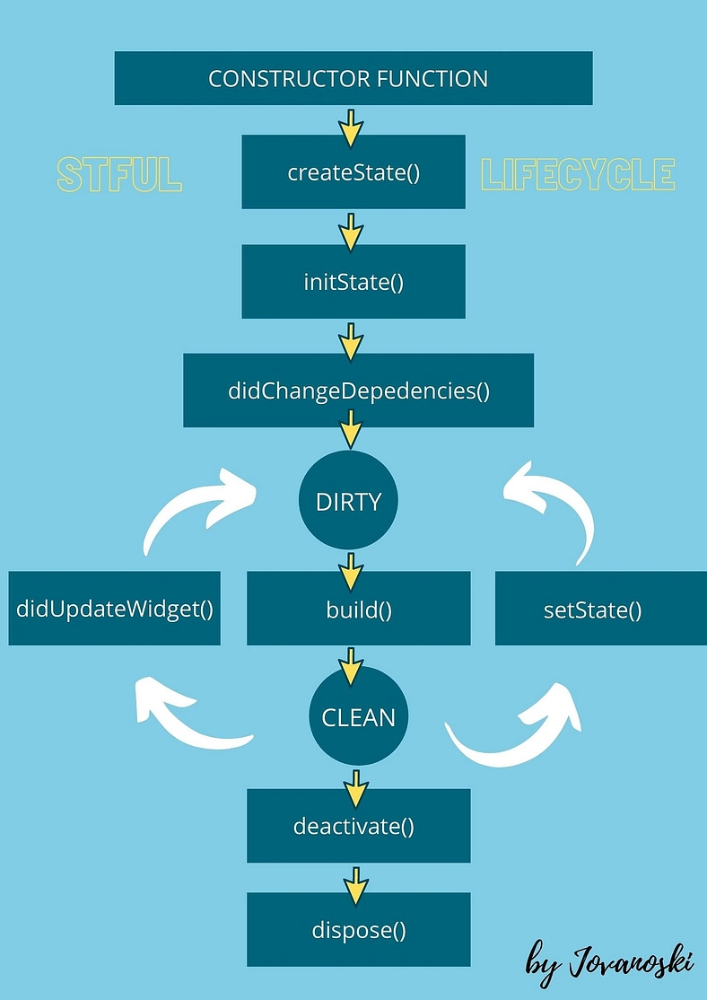

## Flutter Setup on Linux

#### 1. System Dependencies

Update your system and install required packages:

```bash
sudo apt-get update -y && sudo apt-get upgrade -y
sudo apt-get install -y curl git unzip xz-utils zip libglu1-mesa
```

#### 2. Android Development Dependencies

Install required 32-bit libraries for Android app development:

```bash
sudo apt-get install libc6:amd64 libstdc++6:amd64 lib32z1 libbz2-1.0:amd64
```

Install **Android Studio**:

```bash
sudo snap install android-studio --classic
```

After installation:
- Open **Android Studio**
- Install the **Flutter** and **Dart** plugins from the plugin marketplace.

---

#### 3. Download and Install Flutter SDK

Download the Flutter SDK and extract it to your development directory:

```bash
sudo tar -xf ~/Videos/flutter_linux_3.29.2-stable.tar.xz -C /usr/development
```

---

#### 4. Set Up Environment Variables

To use `flutter` commands globally, add it to your `PATH`.

### Edit your shell config file (`.bashrc` or `.bash_profile`):

```bash
nano ~/.bashrc
```

Add the following line to the end of the file:

```bash
export PATH="/usr/development/flutter/bin:$PATH"
```

Save and close:
- Press `Ctrl + X`
- Then `Y`
- Press `Enter`

Apply the changes:

```bash
source ~/.bashrc
```

---

#### 5. Verify Installation

Test your Flutter installation:

```bash
flutter --version
```

You should see the Flutter version output if everything is set up correctly.

##### flutter doctor --android-licenses

##### flutter docker

## create flutter project
> flutter create currency_converter

## Flutter Setup on Linux

#### 1. System Dependencies

Update your system and install required packages:

```bash
sudo apt-get update -y && sudo apt-get upgrade -y
sudo apt-get install -y curl git unzip xz-utils zip libglu1-mesa
```

#### 2. Android Development Dependencies

Install required 32-bit libraries for Android app development:

```bash
sudo apt-get install libc6:amd64 libstdc++6:amd64 lib32z1 libbz2-1.0:amd64
```

Install **Android Studio**:

```bash
sudo snap install android-studio --classic
```

After installation:

- Open **Android Studio**
- Install the **Flutter** and **Dart** plugins from the plugin marketplace.

---

#### 3. Download and Install Flutter SDK

Download the Flutter SDK and extract it to your development directory:

```bash
sudo tar -xf ~/Videos/flutter_linux_3.29.2-stable.tar.xz -C /usr/development
```

---

#### 4. Set Up Environment Variables

To use `flutter` commands globally, add it to your `PATH`.

### Edit your shell config file (`.bashrc` or `.bash_profile`):

```bash
nano ~/.bashrc
```

Add the following line to the end of the file:

```bash
export PATH="/usr/development/flutter/bin:$PATH"
```

Save and close:

- Press `Ctrl + X`
- Then `Y`
- Press `Enter`

Apply the changes:

```bash
source ~/.bashrc
```

---

#### 5. Verify Installation

Test your Flutter installation:

```bash
flutter --version
```

You should see the Flutter version output if everything is set up correctly.

> > flutter doctor --android-licenses

> > flutter docker

## Create a Flutter Project

Create a new project using:

```bash
flutter create currency_converter
```

---

## Project Folder Structure Overview

Here's a brief overview of the generated project structure:

| Folder/File             | Description                                                     |
| ----------------------- | --------------------------------------------------------------- |
| `android/`              | Contains Android-specific code and settings (e.g., permissions) |
| `ios/`                  | Contains iOS-specific code and settings                         |
| `linux/`                | Linux desktop-specific settings                                 |
| `macos/`                | macOS desktop-specific settings                                 |
| `web/`                  | Web-specific structure for Flutter web apps                     |
| `lib/`                  | Main Dart code lives here (`main.dart`)                         |
| `test/`                 | Contains unit and widget test files                             |
| `.gitignore`            | Files to ignore in version control (Git)                        |
| `.metadata`             | Stores metadata about the Flutter project                       |
| `analysis_options.yaml` | Configuration for static analysis and lint rules                |
| `pubspec.yaml`          | Project dependencies and settings                               |
| `pubspec.lock`          | Locked versions of dependencies (auto-generated)                |

###### to run flutter project

> > ctrl + f5 or flutter run

###### to run on emulator 
flutter devices
'flutter emulators --launch [--name xyz]'
flutter run

```dart
import 'package:flutter/material.dart';

void main(){
  runApp(const MyApp());
}

class MyApp extends StatelessWidget{

  const MyApp({super.key});
// this helps Flutter manage the widget’s identity within the widget tree.
  @override
  Widget build(BuildContext context) {
    return const  Text("hello my name is sachin !!!",textDirection: TextDirection.ltr);
  }
}
```

- Widget are responsible for user interface and it describe what all an app have and how it will look

- hot reload for small tuke

###### different widget types in Flutter:

1. **StatelessWidget**:

   - A `StatelessWidget` is a widget that does not maintain any state. The widget’s configuration is immutable, meaning it cannot change once built.
   - It's used when the UI depends solely on the information passed to it and does not need to update itself.
   - Example: `Text`, `Icon`, `Container`, etc.
   - Example code:
     ```dart
     class MyStatelessWidget extends StatelessWidget {
       @override
       Widget build(BuildContext context) {
         return Text('Hello, Stateless!');
       }
     }
     ```

2. **StatefulWidget**:

   - A `StatefulWidget` is a widget that has mutable state. It can change over time, which triggers a rebuild of the widget with updated data.
   - It’s used when the UI depends on dynamic data that may change during the lifetime of the widget (e.g., form input, button clicks, etc.).
   - Example: `TextField`, `Checkbox`, `Slider`, etc.
   - Example code:

     ```dart
     class MyStatefulWidget extends StatefulWidget {
       @override
       _MyStatefulWidgetState createState() => _MyStatefulWidgetState();
     }

     class _MyStatefulWidgetState extends State<MyStatefulWidget> {
       int _counter = 0;

       void _incrementCounter() {
         setState(() {
           _counter++;
         });
       }

       @override
       Widget build(BuildContext context) {
         return Column(
           children: [
             Text('Counter: $_counter'),
             ElevatedButton(
               onPressed: _incrementCounter,
               child: Text('Increment'),
             ),
           ],
         );
       }
     }
     ```

3. **InheritedWidget**:

   - An `InheritedWidget` is a special type of widget that allows data to be shared efficiently down the widget tree. It is commonly used to propagate data from a higher-level widget down to its descendants.
   - It is mainly used for situations where many widgets need access to the same data, like themes, localization, or state management.
   - Example: `InheritedModel`, `Theme`, `MediaQuery`, etc.
   - Example code:

     ```dart
     class MyInheritedWidget extends InheritedWidget {
       final String data;

       MyInheritedWidget({required this.data, required Widget child}) : super(child: child);

       @override
       bool updateShouldNotify(covariant InheritedWidget oldWidget) {
         return true; // Logic for updating should notify based on change
       }

       static MyInheritedWidget? of(BuildContext context) {
         return context.dependOnInheritedWidgetOfExactType<MyInheritedWidget>();
       }
     }

     class MyWidget extends StatelessWidget {
       @override
       Widget build(BuildContext context) {
         final inheritedData = MyInheritedWidget.of(context)?.data;
         return Text(inheritedData ?? 'No data');
       }
     }
     ```

Each widget type serves a specific purpose, depending on whether the widget needs to be immutable (StatelessWidget), mutable (StatefulWidget), or needs to share data (InheritedWidget).

Sure! Here's how you could format your notes in a `.md` (Markdown) file:

````markdown
## Design Systems in Flutter

1.  Material App

- **Material Design** is a design system created by Google. It provides a set of guidelines for creating visually consistent and intuitive user interfaces across platforms.
- In Flutter, the `MaterialApp` widget is the entry point to create applications that follow Material Design principles. It sets up the overall structure and theme of the app.

2. Cupertino App

- **Cupertino** is Apple's design system for iOS. It focuses on the distinct look and feel of iOS interfaces, including navigation, buttons, and controls.
- In Flutter, the `CupertinoApp` widget is used to create apps that follow iOS design principles.

---

## Flutter App Structure

```dart
class MyApp extends StatelessWidget {
  const MyApp({super.key}); // The `super.key` passes the key to the parent class (StatelessWidget)

  @override
  Widget build(BuildContext context) {
    return MaterialApp(
      home: Scaffold(
        body: Center(
          child: Text("Hello, world!"), // A simple text widget displayed in the center
        ),
      ),
    );
  }
}
```
````

### Explanation of Code:

1. `MaterialApp`:

- `MaterialApp` is a widget that sets up the foundation of your app following Material Design principles.
- It provides theming, navigation, and various Material Design components like buttons, dialogs, etc.

2. `Scaffold`:

- The `Scaffold` widget is a basic structure within a `MaterialApp`. It provides a layout with slots for commonly used app features like the app bar, body, floating action buttons, etc.
- It's like a "playground" that arranges the visual components of your app.

3. `Center`:

- The `Center` widget is a simple container that centers its child widget both vertically and horizontally within its parent.

4. `Text`:

- The `Text` widget displays a string of text on the screen. In this case, it shows "Hello, world!" in the center of the screen.

---

##### Key Points:

- **MaterialApp**: Sets up the overall structure of the app and applies the Material Design system.
- **Scaffold**: Provides the basic visual structure within the app and can contain multiple sections (e.g., AppBar, body, FloatingActionButton).
- **Center**: Used to align widgets (like `Text`) in the center of the screen.

---

### Code Seperation

```dart
import 'package:currency_converter/currency_cinverter_page.dart';
import 'package:flutter/material.dart';

void main(){
  runApp(const MyApp());
}

class MyApp extends StatelessWidget{

  const MyApp({super.key});
// this helps Flutter manage the widget’s identity within the widget tree.
  @override
  Widget build(BuildContext context) {
    return MaterialApp(
      home:CurrencyConverterPage()
    );
  }
}

```

```dart
import 'package:flutter/material.dart';

class CurrencyConverterPage extends StatelessWidget {

  const CurrencyConverterPage({super.key});

  @override
  Widget build(BuildContext context)
  {
    return Scaffold(
        body:Center(
          child:Text("hello world !!!")
        )
      );
  }
}
```

###### every statelesswidget has its own BuildContext so flutter could know its location

## Column

column does not paint any thing on ui and its related to layout that except list of widgets

```dart
Center(
          child: Column(
            mainAxisAlignment: MainAxisAlignment.start,
          children: [
            Text('0'),
            Text('0')
          ],
        ),
        )
```

## mainAxisAlignment , crossAxisAlignment , Color Widget , text style and font weight,Color,Colors,TextField,decoration (InputDecoration), lable text, hintText, hintStyle, prefix text,

prifixIcon, Icons , SuffixIcon,SuffixIconColor ,Fill , FilledColor

```dart
import 'package:flutter/material.dart';

class CurrencyConverterPage extends StatelessWidget {
  const CurrencyConverterPage({super.key});

  @override
  Widget build(BuildContext context) {
    // every statelesswidget has its own BuildContext so flutter could know its location
    return const Scaffold(
      backgroundColor: Colors.cyan,
      body: Center(
        child: Column(
          mainAxisAlignment: MainAxisAlignment.center,
          crossAxisAlignment: CrossAxisAlignment.center,
          children: [
            Text(
              '0',
              style: TextStyle(
                fontSize: 35,
                fontWeight: FontWeight.bold,
                color: Color.fromARGB(255, 255, 255, 255),
              ),
            ),
            // Container(
              // padding: EdgeInsets.all(8.0),
              // margin:  EdgeInsets.all(8.0)
            // ),
            Padding(
              padding: EdgeInsets.all(8.0),
              child: TextField(
                style: TextStyle(color: Colors.white),
                decoration: InputDecoration(
                  labelText: "enter something",
                  hintText: "aadasd",
                  prefixText: "hello",
                  prefixIcon: Icon(Icons.access_alarm_sharp),
                  filled: true,

                  // contentPadding: ,
                  fillColor: Colors.white,
                  focusedBorder: OutlineInputBorder(
                    borderSide: BorderSide(
                      color: Colors.red,
                      width: 10.0,
                      style: BorderStyle.solid,
                      strokeAlign: BorderSide.strokeAlignCenter,
                    ),
                    // borderRadius: BorderRadius.all(Radius.circular(10))
                    // borderRadius:BorderRadius.horizontal(left: Radius.circular(60))
                    // borderRadius:BorderRadius.vertical(top: Radius.circular(60))
                  ),
                ),
                // keyboardType: TextInputType.number,
                keyboardType: TextInputType.numberWithOptions(
                  decimal: true,
                  signed: true,
                ),
                //  scrollPadding: ,
              ),
            ),
          ],
        ),
      ),
    );
  }
}

```

## Print

```dart
    print("button click");
              debugPrint("check this");
```

## CHeck debug mode

```dart
              if(kDebugMode){
              print("button click");
              }
```

flutter run --release
flutter run --profile

## check debug mode

```dart
 if(kDebugMode){
              print("button click");
              }
```

## Button

- TextButton

```dart
TextButton(onPressed: () {
              if(kDebugMode){
              print("button click");
              }
              debugPrint("check this");
             }, style:ButtonStyle(
              backgroundColor: WidgetStatePropertyAll(Colors.amber),
              // fixedSize: WidgetStatePropertyAll(Size(double.infinity,50))
              minimumSize: WidgetStatePropertyAll(Size(double.infinity,50))
             ),
             child: const Text("click me"))
```

2. ElevatedButton and elevated:WidgetStatePropertyAll(15)

simillar to button but slighty elevated

```dart
 ElevatedButton(onPressed: () {
              if(kDebugMode){
              print("button click");
              }
              debugPrint("check this");
             }, style:ButtonStyle(
              elevated:WidgetStatePropertyAll(15)
              backgroundColor: WidgetStatePropertyAll(Colors.amber),
              // fixedSize: WidgetStatePropertyAll(Size(double.infinity,50))
              minimumSize: WidgetStatePropertyAll(Size(double.infinity,50)),
                            shape: WidgetStatePropertyAll(BeveledRectangleBorder())
             ),
             child: const Text("click me"))
```

## with WidgetStatePropertyAll and without this
```dart
style:TextButton.styleFrom(
              backgroundColor: Colors.amber,
              // fixedSize: WidgetStatePropertyAll(Size(double.infinity,50))
              minimumSize: Size(400,50),
              shape: BeveledRectangleBorder()
             ),
```

## AppBar
```dart
appBar: AppBar(
        backgroundColor: Colors.amber,
        // elevation: 0,
        title: Text("app abr"),
        centerTitle: true,
        actions:[
          Text("exits"),
          Text("exits2")
        ]
      ),
```

## Excess value from input fields
 final TextEditingController textEditingController=TextEditingController();
 TextField(
                controller: textEditingController)
textEditingCOntroller.text  // when
double.parse(textEditingCOntroller.text)
 want to access value 

 >> int.parse

 ## StateFullWidget

 ```dart
 class CurrencyCinverterPagee extends StatefulWidget{
  const CurrencyCinverterPagee({super.key});

  @override
  State createState()=>_Currency();

}

class _Currency extends State{
  @override
  Widget build(BuildContext context) {
  int result=0;
     final TextEditingController textEditingController=TextEditingController();
    return  Scaffold(
      backgroundColor: Colors.cyan,
      appBar: AppBar(
        backgroundColor: Colors.amber,
        // elevation: 0,
        title: Text("app abr"),
        centerTitle: true,
        actions:[
          Text("exits"),
          Text("exits2")
        ]
      ),
      body: Center(
        child: Column(
          mainAxisAlignment: MainAxisAlignment.center,
          crossAxisAlignment: CrossAxisAlignment.center,
          children: [
            Text(
              '0',
              style: TextStyle(
                fontSize: 35,
                fontWeight: FontWeight.bold,
                color: Color.fromARGB(255, 255, 255, 255),
              ),
            ),
            // Container(
            // height:10,
              // padding: EdgeInsets.all(8.0),
              // margin:  EdgeInsets.all(8.0)
            // ),
            Padding(
              padding: EdgeInsets.all(8.0),
              child: TextField(
                controller: textEditingController,
                style: TextStyle(color: Colors.white),
                decoration: InputDecoration(
                  labelText: "enter something",
                  hintText: "aadasd",
                  prefixText: "hello",
                  prefixIcon: Icon(Icons.access_alarm_sharp),
                  filled: true,

                  // contentPadding: ,
                  fillColor: Colors.white,
                  focusedBorder: OutlineInputBorder(
                    borderSide: BorderSide(
                      color: Colors.red,
                      width: 10.0,
                      style: BorderStyle.solid,
                      strokeAlign: BorderSide.strokeAlignCenter,
                    ),
                    // borderRadius: BorderRadius.all(Radius.circular(10))
                    // borderRadius:BorderRadius.horizontal(left: Radius.circular(60))
                    // borderRadius:BorderRadius.vertical(top: Radius.circular(60))
                  ),
                ),
                // keyboardType: TextInputType.number,
                keyboardType: TextInputType.numberWithOptions(
                  decimal: true,
                  signed: true,
                ),
                //  scrollPadding: ,
              ),
            ),
            TextButton(onPressed: () {
              if(kDebugMode){
              print("button click");
              }
              debugPrint("check this");
             }, style:TextButton.styleFrom(
              backgroundColor: Colors.amber,
              // fixedSize: WidgetStatePropertyAll(Size(double.infinity,50))
              minimumSize: Size(400,50),
              shape: BeveledRectangleBorder()
             ),
             child: const Text("click me"))
          ],
        ),
      ),
    );
  } 
}
```

## FLows in  StatefullWIdget

>> constructor --> createState --> initState --> didCHangeDependencies --> build --> dispose

```dart
class CurrencyCinverterPagee extends StatefulWidget {
  CurrencyCinverterPagee({super.key}) {
    if (kDebugMode) {
      print("constructor");
    }
  }

  @override
  State createState() {
    if(kDebugMode){
    print("createState");
    }
    return _Currency();
  }
}
```

```dart
class _Currency extends State {
  late double result;

  @override
  void initState() {
    if(kDebugMode){
      print("initi state");
    }
    super.initState();
  }
}
```

## Rerender & rebuild
setState help in rerender

```dart
          setState(() {
                  result=double.parse(textEditingController.text);
                });

                or
                  
result=double.parse(textEditingController.text);
 setState(() {  });
```

## Container vs BoxSize
connot use const with container which makes it rebuild when rebuild reform

const SizeBox(height:10)

## toStringAsFixed()
 toStringAsFixed(2  )

## Cupertino Widget
import "package:flutter/cupertino.dart";

CupertinoPageScaffold ( // top navbar )
CupertinoTabScaffold ( // bottom footer )
 
```dart

class MyAppCupertino extends StatelessWidget{

  const MyAppCupertino({super.key});
// this helps Flutter manage the widget’s identity within the widget tree.
  @override
  Widget build(BuildContext context) {
    return CupertinoApp(
      home:MyWidget()
    );
  }
}

import 'package:flutter/cupertino.dart';

class MyWidget extends StatefulWidget {
  const MyWidget({super.key});

  @override
  State<MyWidget> createState() => _MyWidgetState();
}

class _MyWidgetState extends State<MyWidget> {
  double result = 0;
  final TextEditingController textEditingController = TextEditingController();

  @override
  void initState() {
    super.initState();
  }

  @override
  Widget build(BuildContext context) {
    return CupertinoPageScaffold(
      backgroundColor: CupertinoColors.activeBlue,
      navigationBar: CupertinoNavigationBar(
        backgroundColor: CupertinoColors.activeBlue,
        middle: Text("app abr"),
      ),
      child: Center(
        child: Column(
          mainAxisAlignment: MainAxisAlignment.center,
          crossAxisAlignment: CrossAxisAlignment.center,
          children: [
            Text(
              "$result",
              style: TextStyle(
                fontSize: 35,
                fontWeight: FontWeight.bold,
                color: Color.fromARGB(255, 255, 255, 255),
              ),
            ),
            Padding(
              padding: EdgeInsets.all(8.0),
              child: CupertinoTextField(
                placeholder: "placeholder",
                prefix: Icon(CupertinoIcons.add_circled),
                controller: textEditingController,
                style: TextStyle(
                  color: CupertinoColors.extraLightBackgroundGray,
                ),
                decoration: BoxDecoration(
                  color: CupertinoColors.activeBlue,
                  border: Border.all(),
                  borderRadius: BorderRadius.circular(5),
                ),
                // keyboardType: TextInputType.number,
                keyboardType: TextInputType.numberWithOptions(
                  decimal: true,
                  signed: true,
                ),
                //  scrollPadding: ,
              ),
            ),
            CupertinoButton(
              onPressed: () {
                debugPrint("check this");
                setState(() {
                  result = double.parse(textEditingController.text);
                });
              },
              color: CupertinoColors.destructiveRed,
              child: const Text("click me"),
            ),
          ],
        ),
      ),
    );
  }
}
```

## didChangeDependencies
  @override
  void didChangeDependencies(){
    super.didChnageDependencies();
  }

## didUpdateWidget
  @override
  void didUpdateWidget(covariant MyStateFulWidget oldWidget){
    super.didUpdateWidget(oldWidget);
  }

## Dispose
is used to remove curtain things from widget tree and this helps in memory leak
```dart

  @override
  void dispose(){
    textEditingController.dispose(); 
    super.dispose();
  }
```


## Theme
```dart
Widget build(BuildContext context) {
    return MaterialApp(
      title: 'Flutter Demo',
      theme: ThemeData(
        colorScheme: ColorScheme.fromSeed(seedColor: Colors.deepPurple),
      ),
      home: const MyHomePage(title: 'Flutter Demo Home Page'),
    );
  }
// this theme can be access in children
 backgroundColor: Theme.of(context).colorScheme.inversePrimary,
```

## FLoating button 
```dart
  body:Center(),
floatingActionButton: FloatingActionButton(
        onPressed: _incrementCounter,
        tooltip: 'Increment',
        child: const Icon(Icons.add),
      ),
```

## Placeholder
```dart
  @override
  Widget build(BuildContext context) {
    return const Placeholder();
  }

  const Placeholder(
            fallbackHeight:250 ,
            // child:Text("main card")  if we use this this , placeholder will take only space require to the children
          )
```

## remove banner symbol  ( debugShowCheckedModeBanner: false )
```dart
return MaterialApp(
      debugShowCheckedModeBanner: false,
      home:const WeatherScreen(),
    );
```

## theme 
```dart
ThemeData.dark(useMaterial3: true).copyWith(
        appBarTheme: AppBarTheme()
      ),
```

## Guesture Detecture
simillar to button 
```dart
GestureDetector(onTap:(){},child:  Icon(Icons.refresh))
```

## InkWell
silllar to Guesture but have a splash on button when click

```dart
InkWell(onTap:(){},child:  Icon(Icons.refresh))
```

## IconButton
```dart
IconButton(onPressed:(){},icon:  Icon(Icons.refresh))
```
##  SingleChildScrollView
gives a scrollable view
```dart
body: SingleChildScrollView(
        // scrollDirection:Axis.vertical
        scrollDirection:Axis.horizontal
        child: Column(
          children: [
            const Placeholder(
              fallbackHeight: 250,
              // child:Text("main card")
            ),
            const SizedBox(height: 25),
            const Placeholder(fallbackHeight: 150),
            const SizedBox(height: 25),
            const Placeholder(fallbackHeight: 150),
          ],
        ),
      ),
```

## Card

```dart
Card(child: Column(children: [
              
            ]))
```
if we want card to have complete width 
use container

```dart
Container(
  width:double.infinity

)

// if its only width use SizedBox

SizedBox(
  width:double.infinity

)

```

## EdgeInsets ( for padding and margin )
EdgeInsets is a class used to define the amount of padding or margin around a widget. 

```dart
padding: const EdgeInsets.all(8.0)
padding: const EdgeInsets.symmetric(horizontal: 16.0, vertical: 8.0),
padding: const EdgeInsets.only(left: 10.0, top: 5.0, right: 10.0),
padding: const EdgeInsets.fromLTRB(10.0, 20.0, 10.0, 30.0),
```
## Icons
Icon(Icons.cloud,size:44)

## Elevation
the elevation property is used to define the "depth" or "shadow" of a widget

elevation: 10

## RoundedRectangleBorder (Different Border Radius)

change the shape of the widget by altering the borderRadius in RoundedRectangleBorder.

```dart
shape: RoundedRectangleBorder(
    borderRadius: BorderRadius.circular(10), // Slightly rounded corners
  ),

shape: RoundedRectangleBorder(
    borderRadius: BorderRadius.only(
      topLeft: Radius.circular(20),
      topRight: Radius.circular(40),
      bottomLeft: Radius.circular(60),
      bottomRight: Radius.circular(80),
    ),
  ),

  shape: CircleBorder()

  shape: BeveledRectangleBorder(
    borderRadius: BorderRadius.circular(12), // Beveled corners
  ),

    shape: StadiumBorder(), //

 shape: RoundedRectangleBorder(
    borderRadius: BorderRadius.circular(15),
  ),

  shape: CircleBorder(),

  shape: BeveledRectangleBorder(
    borderRadius: BorderRadius.circular(12),
  ),
```

## BackDropFIlter 
```dart

BackdropFilter(
  filter:ImageFIlter.blur(sigmaX:10,sigmaY;10)
)
```

## CLipRRect()
used to clip (or crop) its child widget into a rounded rectangle shape
```dart
ClipRRect(
  borderRadius.circular(16),
  child:
)

```

Container is a more general-purpose widget used for layout and decoration, allowing you to control size, alignment, and visual styles.

ClipRRect is a specialized widget used primarily for clipping its child into a rounded rectangle shape, but it doesn’t offer decoration, padding, or other layout features like Container.

## Align
```dart
Align(
alignment:Alignment.centerLeft,
child:
)
```

## Row
```dart
Row(
  children:[] 
)


```

## COntainer radius
```dart
Conatiner(
  decoration:BoxDecoration(
    borderRadius:BorderRadius.circular(12)
  )
)
```

## Spacing and runSpacing (tailwind gap )
```dart
  spacing: 20, // Horizontal gap
  runSpacing: 20, // Vertical gap
```

## Passing Argument
```dart
AdditionalItems(icon:Icons.water,label:"hum",value:"91")

class AdditionalItems extends StateLessWidget{
final String icon;
final String label;
const AdditionalInfoItem({super.key,required this.icon})

}
```

## http
go in pub.dev --> search http --> copy --> paste in dev dependencies or dependencies  --> flutter pub get (command update the dependencies list)

```dart

@override 
void initState(){
  super.initState();
  getCurrentWeather();
}

  Future getCurrentWeather() async {
    try {
      String cityName="London";  
      // var url = Uri.https('example.com', 'whatsit/create');
      final res=await http.get(Uri.parse(""));
      final data=jsonDecode(res.body);
      
    setState((){
      temp=data['list'][0]['main']['temp'];
    })
    } catch (e) {
      throw e.toString ();
    }
  }

```


## loading widget
```dart

LinearProgressIndicator()
CircularProgressIndicator()
CircularProgressIndicator.adaptive()
```

## FutureBuilder
```dart
body:FutureBuilder(
  future:getCurrentWeather(),
  builder:(context,snapshot){
    if(snapshot.connectionState == ConnectionState.waiting){
      return const CircularProgressIndicator();
    }
    if(snapshot.hasError){
      return const Text(snapshot.error.toString());
    }

    if(snapshot.hasData){
      return const Text("data possibly null");
    }
    final data=snapshot.data!;

    return Padding(
    padding:const EdgeInsets.all(16.0)
    child:Text("sachin")
   )
  }
)
```

## Lazy loading (ListView())

before 
```dart
for(int i =0;i<40;i++){
  return Text("hello $i")
}
```

after
```dart
SizedBox(
height:15 0,
child:ListView.builder(
  scrollDirection:Axis.horizontal
  itemCount:5,
  itemBuilder:(context,index){
    return Text("hello $i")
  }
)
)
```

## Overflow and maxLine
```dart
Text(time,style:const TextStyle(
  fontSize:16,
  fontWeight;FOntWeight.bold
),
maxLines:1,
overflow:TextOverflow.ellipsis // for ....
overflow:TextOverflow.fade
overflow:TextOverflow.visible
)
```

## Dart DateTime Formatting Examples using intl

This file demonstrates how to use the `intl` package in Dart to format `DateTime` in different styles using `DateFormat`.

---

### 📦 Importing the Package

```dart
import 'package:intl/intl.dart';
```

---

### 🕒 Example DateTime

```dart
final dateTime = DateTime.parse('2025-04-09 15:45:00');
```

---

### ⏰ Time Formats

| Format | Description         | Example Code                               | Output     |
|--------|---------------------|--------------------------------------------|------------|
| `Hm()` | Hour and Minute     | `DateFormat.Hm().format(dateTime)`         | `15:45`    |
| `Hms()`| Hour, Min, Second   | `DateFormat.Hms().format(dateTime)`        | `15:45:00` |
| `j()`  | Local time format   | `DateFormat.j().format(dateTime)`          | `3:45 PM` or `15:45` |
| `jm()` | Hour:Minute + AM/PM | `DateFormat.jm().format(dateTime)`         | `3:45 PM`  |
| `jms()`| Full time with AM/PM| `DateFormat.jms().format(dateTime)`        | `3:45:00 PM`|

---

### 🗓️ Date Formats

| Format         | Description              | Example Code                               | Output        |
|----------------|--------------------------|--------------------------------------------|---------------|
| `yMd()`        | Short Date               | `DateFormat.yMd().format(dateTime)`        | `4/9/2025`    |
| `yMMMd()`      | Medium Date              | `DateFormat.yMMMd().format(dateTime)`      | `Apr 9, 2025` |
| `yMMMMd()`     | Full Month Date          | `DateFormat.yMMMMd().format(dateTime)`     | `April 9, 2025`|
| `EEE, MMM d`   | Custom Weekday/Month     | `DateFormat('EEE, MMM d').format(dateTime)`| `Wed, Apr 9`  |
| `yyyy-MM-dd`   | ISO-style Date           | `DateFormat('yyyy-MM-dd').format(dateTime)`| `2025-04-09`  |

---

### ⏰ Date + Time Formats

| Format              | Example Code                                        | Output                  |
|---------------------|-----------------------------------------------------|-------------------------|
| `yMd().add_jm()`    | `DateFormat.yMd().add_jm().format(dateTime)`       | `4/9/2025 3:45 PM`      |
| `yMMMMd().add_Hms()`| `DateFormat.yMMMMd().add_Hms().format(dateTime)`   | `April 9, 2025 15:45:00`|

---

### 🌐 Locale Example

```dart
DateFormat.yMMMMd('fr_FR').format(dateTime); // Output: 9 avril 2025
```

---

### 🛠️ Custom Pattern Example

```dart
final custom = DateFormat('dd-MM-yyyy HH:mm');
print(custom.format(dateTime)); // Output: 09-04-2025 15:45
```

---

### 📚 Notes

- Make sure to include `intl` in your `pubspec.yaml`:
  ```yaml
  dependencies:
    intl: ^0.18.1
  ```

- Always initialize the formatter once if reusing.
- Use `.toLocal()` or `.toUtc()` to control timezone behavior.

---

### ✅ Tip

You can chain `.add_*()` methods to combine formats:
```dart
DateFormat.yMMMd().add_jm(); // Apr 9, 2025 3:45 PM
```


## 🔍 Behind the Scenes in Flutter

Understanding the internal structure of how Flutter builds and renders UI:
- **Widget Tree**
- **Element Tree**
- **Render Object Tree**

---

### 🧱 1. Widget Tree
- **Definition**: A configuration blueprint.
- **Nature**: Immutable and lightweight.
- **Purpose**: Describes how the UI should look.
- **Example**: `Text('Hello')`, `Container`, `Row`, `Column`, etc.

> Every time `build()` is called, a **new Widget Tree** is created.

---

### 🌳 2. Element Tree
- **Definition**: Acts as a bridge between widgets and render objects.
- **Nature**: Mutable.
- **Purpose**: Maintains lifecycle, context, and links widgets to render objects.
- **Types**:
  - `StatelessElement`
  - `StatefulElement`
  - `ComponentElement`
  - `RenderObjectElement`

> The Element Tree is **reused and updated** rather than recreated on rebuilds.

---

### 🎨 3. Render Object Tree
- **Definition**: Represents the layout and painting layer of the UI.
- **Nature**: Mutable and heavyweight.
- **Purpose**: Handles layout, painting, and hit testing.
- **Examples**:
  - `RenderBox`
  - `RenderParagraph`

> Only widgets that affect layout or painting (like `Container`) create render objects.

---

### 🔁 The Process (Simplified)

1. Flutter builds the **Widget Tree**.
2. The framework creates or updates the **Element Tree** to manage state and widget lifecycles.
3. Based on the elements, it builds the **Render Object Tree** for layout and painting.

---

### 🧠 Summary Table

| Tree                | Contains                 | Mutable? | Role                                 |
|---------------------|--------------------------|----------|--------------------------------------|
| **Widget Tree**     | UI Description           | ❌        | Blueprint for UI                     |
| **Element Tree**    | Widgets + Context + State| ✅        | Manages lifecycle, bridges widget ↔ render |
| **Render Object Tree** | Layout & Painting Logic| ✅        | Performs actual layout and drawing   |

---


## use google fonts ( google_fonts ) 

```dart
import 'package:google_fonts/google_fonts.dart';

Text(
  'This is Google Fonts',
  style: GoogleFonts.lato(),
),

or

Text(
  'This is Google Fonts',
  style: GoogleFonts.lato(
    textStyle: TextStyle(color: Colors.blue, letterSpacing: .5),
  ),
),
```

## Register fonts in app in pubspec.yaml
uncomment 

fonts:
    - family: Schyler
      fonts:
        - asset: fonts/Schyler-Regular.ttf
        - asset: fonts/Schyler-Italic.ttf
          style: italic

download file from google fonts website

assests/fonts/file.ttf


fonts:
    - family: Lato
      fonts:
        - asset: fonts/loto-light.ttf
        - asset: fonts/loto-light.ttf
          weight: 700

use 
Text(
  "",
  style:TextStyle(fontFamily:"Lato")
)

use in theme
```dart
theme:ThemeData(
  fontFamilt:"Lato",
  colorScheme:ColorScheme(brightness:brightness,primary:primary)

  ColorSchema.fromSeed(seedColor:Color.red,)
)
  color: Theme.of(context).colorScheme.onBackground

    backgroundColor: Theme.of(context).colorScheme.primary,
```
## use of hex code
  primary: Color(0xFF3498db),  // Set primary color to a hex color (#3498db)

## Safe area
```dart
SafeArea(
  child:
)

```

## take remaining available space
```dart
Expanded(
  child:TextField()
)

or 

 Expanded(
          flex:2,
          child: Text("hello")),
        ),
```

## same theme  for all InputDecoration
```dart
inputDecorationTheme:InputDecorationTheme(
  hintStyle:TextStyle(
    fontWeight:FontWeight.bold,
    fontSize:16
  )
),
textTheme:const TextTheme(
  titleLarge:TextStyle(
    fontWeight:TextStyle(
      fontWeight:FontWeight.bold,
      fontSize:35
    )
  ),
  titleMedium:TextStyle(
    fontWeight:FontWeight.bold,fontSize:20
  ),
  bodySmall:TextStyle(
    fontWeight:FontWeight.bold,fontSize:20,
  )
)

// to access use context
style : Theme.off(context).textTheme.titleLarge
```

## Chip
```dart
Chip(label:"All",padding:,backgroundColor: )
```

```dart

final List<String> names;
final String firstName = names[0]; // ❓

// Not directly like that at the class level. 
```

```dart
  final String firstName;
  final String lastName;
  final int age;

  // 👇 Initializer list with multiple fields
  MyClass()
      : firstName = "Sachin",
        lastName = "Tendulkar",
        age = 50;

```
## to use assest
have images in a assest folder
go in pubspec.yaml
assests:
- assests/image/shoes_1.png
- assests/image/shoes_1.png

for all images 
assests/images/

## IMage 
Image.asset('assets/images/shoes_1.png',height:20),

or 

Image(image:AssestImage(image))


## Spacer
```dart
Spacer(
  flex:2
)

```

## Stack
```dart
Stack(
  children:[
    Text("Hi"),
    Text("Hello")
  ]
)
```

## Navigation & Routing

Navigator widget it was created my MatrialAPp or cupertinoApp

```dart
GestureDetecture(
  onTap:(){
    Navigator.of(context).push(PageRouteBUilder(pageBuilder:)) // add in screen stack and move
    Navigator.of(context).pushReplacement() // pop from screen stack
    Navigator.of(context).pop() // pop from screen stack

  }
)

 Navigator.of(context).push(PageRouteBUilder(pageBuilder:))

Navigator.of(context).push(
  PageRouteBuilder(
    pageBuilder: (context, animation, secondaryAnimation) => const SecondPage(),
    transitionsBuilder: (context, animation, secondaryAnimation, child) {
      // Fade transition example
      return FadeTransition(
        opacity: animation,
        child: child,
      );
    },
    transitionDuration: const Duration(milliseconds: 500),
  ),
);


// for transition
 Navigator.of(context).push(MaterialPageRoute(builder:(context){
  return ProductDetailPage();
 }))

Navigator.of(context).push(
  PageRouteBuilder(
    pageBuilder: (context, animation, secondaryAnimation) =>
        const ProductDetailPage(),
    transitionsBuilder: (context, animation, secondaryAnimation, child) {
      return FadeTransition(
        opacity: animation,
        child: child,
      );
    },
    transitionDuration: const Duration(milliseconds: 400),
  ),
);

// slide animation instead?

transitionsBuilder: (context, animation, secondaryAnimation, child) {
  return SlideTransition(
    position: Tween<Offset>(
      begin: const Offset(1.0, 0.0), // from right to left
      end: Offset.zero,
    ).animate(animation),
    child: child,
  );
}

```

## Bottom navbar
```dart

int currentPage=0;
body:currentPage==0?Text('hello');Text("hello"),

or
List<Widget> pages =const [ProductList(),CartPage()]

body:pages[currentPage]

// this maintain the position i left
body:IndexedStack(
  index:currentPage,children:pages
)

bottomNavigationBar:BottomNavigationBar(
  currentIndex:currentPage,

  items:[
  BottomNavigationBarItem(
    iconSize:35,
    selectedFOntSize:0,
    unselectedFontSize:0,
    onTap:(value){
      setState((){
        current=value;
      })
      
    },
    icon:Icon(Icons.home),
    label:""
  ),
  BottomNavigationBarItem(
    icon:Icon(Icons.shopping_cart)
  )
])
```

## ListTitle
```dart
ListTitle(
  leading:CircleAvatar(
    backgroundImage:AssestImage(assestImage)
  )
  title:Text(
    cartItem["title"].toString(),

  ),
  trailing:IconButton(onPresssed:(){

  },icon:Icon(Icons.delete,color:Colors.red))
  subtitle:Text(`Size: ${num}`)
)
```

## State Management with Provider (alternative riverpod ), SnackBar

provider : ^1.2.2
>> provider

* Provider (read only value)
* ChangeNotifierProvider ( update the value and notify others )
* FutureProvider (listen , subscribe and show changes )
* StreamProvider 

```dart
Provider(
  create:(context)=>'hello world'
  child:MaterialApp
)

Provider.of<String>(context)

```

```dart
ChangeNotifierProvider(
  create:(context)=>CartProvider()
  child:MaterialApp
)

Provider.of<String>(context)


class CartProvider extends ChangeNotifier{
final List<String ,dynamic> cart=[]
}

void addProduct(){
  notifyListners();
}

void removeProduct(){

}

Provider.of<CartProvider>(context,listen:false).addProduct(widget.product) 

void onTap(){
  Provider.of<CartProvider>(context,listen:false).addProduct(widget.product) 

or
  context.read<CartProvider>().addProduct(widget.product) 
}
```

###### Snackbar Dialog
```dart
ScaffoldMessenger.of(context).showSnakBar(SnaCKbAR(content:Text("hello")))
```

>> to listner put 
Provider.of<CardProvider>(context).cart inside build
or
final cart=context.watch<CartProvider>().cart
## SHow Dialog
```dart
onPressedL(){
ShowDialog(
  barrierDismissible:false,
  context:context,builder:(context){
  return Dialog(
    child:Text("")
  )

  AlertDialog(
    title:Text(""),
    content:Text(""),
    actions:[
      Text(""),Text("")
    ]
  )
})
}

```

## MultiProvider
MultiProvider(
  provider:[
    ChangeNotifierProvider(create:(context)=>CartProvider())
  ]
)