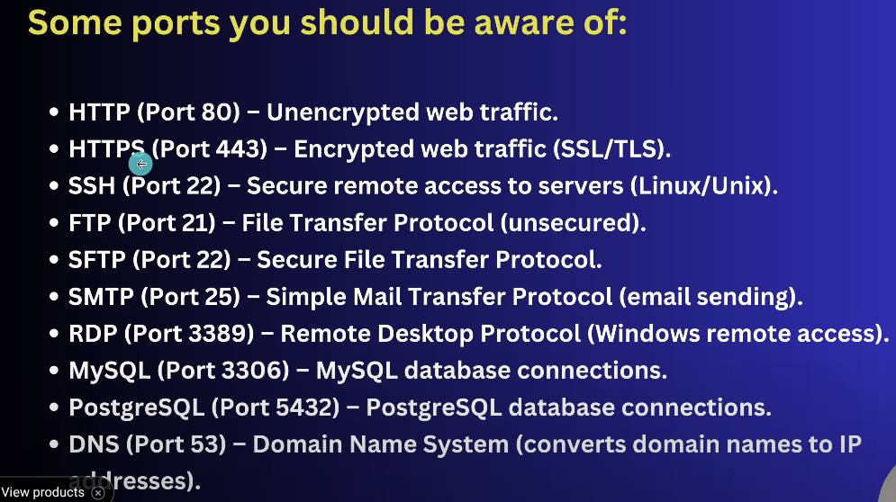

#                AWS ( Amazon Web Serivce )

###### Virtual machine
A virtual machine (VM) is a software-based emulation of a physical computer that allows you to run different operating systems and applications on a single physical machine

HOST OS 
8GM RAM 
|
|
Hipervisor --- 2GM RAM VM2
|
|
2GM RAM
VM1

Hupervisor :- it is a software that creates and runs virtual machine(VMs)

###### Types of hypervisor
1. Type1 (Bare Metal)
2. Type2 (Hosted)

 Type 1 hypervisors, also known as bare-metal or native hypervisors, run directly on the host's hardware with basic os is on hypervisor, while Type 2 hypervisors, also called hosted hypervisors, run on top of a host operating system. 


###### Cloud computing
Cloud computing is a model for delivering computing services—including servers, storage, databases, networking, software, analytics, and intelligence—over the internet

###### Service Types (Cloud Service Models)

* IaaS (Infrastructure as a Service)

Provides virtualized computing resources like servers, storage, and networking.

Example: AWS EC2, Google Compute Engine.

* PaaS (Platform as a Service)

Provides a platform with tools and services for developers to build and deploy applications without managing infrastructure.

Example: Google App Engine, Heroku.

* SaaS (Software as a Service)

Delivers ready-to-use software applications over the internet.

Example: Gmail, Microsoft 365, Dropbox.

###### Deployment Models:
* Public Cloud:
Cloud infrastructure is owned and operated by a third-party provider and accessed by multiple users over the internet. 
* Private Cloud:
Cloud infrastructure is dedicated to a single organization, either on-premises or hosted by a third-party. 
* Hybrid Cloud:
Combines public and private clouds, allowing organizations to leverage the benefits of both. 
* Community Cloud:
Cloud infrastructure is shared by several organizations with common interests or goals.

## IAM
AWS Identity and Access Management (IAM) is an Amazon Web Services (AWS) service that enables secure control over access to AWS resources. It allows administrators to manage who can be authenticated (signed in) and authorized (have permissions) to utilize AWS services and resources within an AWS account. 

IAM is global service
>> use case of IAM
1. create user
2. assign permission
user level permission or group level permission for not assinging same access to multiple user
3. create group

```json
{
    "Version": "2012-10-17",
    "Statement": [
        {
            "Effect": "Allow",
            "Action": "*",
            "Resource": "*"
        }
    ]
}
```

4. create roles
can create roles to assign temporary permission to aws
services

5. define policies
6. manage federatd access

##### MFA 
Multi-factor authentication

#### Way to access AWS
* AWS management console ( web approach )
* AWS CLI ( command line )
* AWS SDKs and APIs ( code based access )

#### AWS CLI 
>> in linux 
curl "https://awscli.amazonaws.com/awscli-exe-linux-x86_64.zip" -o "awscliv2.zip"

unzip awscliv2.zip

sudo ./aws/install

>> on AMzon Linux 
sudo yum install awscli -y

#### CLI configuration
need Aws access key id
go to user and open user and go to security and create access , access key for command line and then create

on command line 
aws configure 
add key and secret key
default region ap-south-1
output format press enter

>> aws iam list-users

## AWS EC2 Service
Amazon Elastic Compute Cloud
is a cloud services that provides resizable virtual servies, called instances which you can use to run applications

1. Instance type
Select the hardware capacity
2. AMI (Amazon Machine Image)
Choose the operating systemand software (linux,mac)
3. Storage 
configure the type and size of storage (EBS volume)
4. Security Group
Set up firewall rule to controll inbound/outbound traffic
5. key pair
create or use an existing key pair for SSH access
6. Network Settings 
configure VPC, subset, and assign public or private ip address
7. IAM role
attach and IAM role for permission to access other AWS resource
8. User Data
Add scripts to be executed when the instance starts
9. Elastic IP
optionally associate a static IP address for consistent public access

Security group has 
inbould and outbound rule
* all inbound traffic blocked and outbound allowed by default
* 80 port for http and 22 for ssh



### SSH into EC2
1. use connect 
2. 
(i) chmod 400 key.pem
(ii) ssh -i /path/to/your-key.pem ubuntu@<public-ip>

Ubuntu → ubuntu
Amazon Linux → ec2-user
RHEL → ec2-user
CentOS → centos

Instace type and purchasing option instance

## EBS Service
Elastic Block Store

configure storage of an instance
is a cloud based storage service that provides durable, high-performance block storage for use with amazon EC2 instance.

it works like a virtual hard drive, allowing you to store and access data even when your ec2 instance are stopped or terminate 

1. region based store
if a EBS is on X-region an instance on Y-region can't access it 
2. if an EBS if fail , data still be in region but if region fail . data lost . for this we can opt backup
3. 
gp3 general purpose SSD
Provisioned IOPS (input outpit per second)
st1
sc1
4. scalable

#### attached an EBS to instance

#### snapshot
create a backup of EBS and also helps in creating a EBS from one region to another ( copy snampshot )

lifecycle manager is use to automate snapshot things

## AMI service
Amazon Machine Image
Type	Included in AMI?
OS, software, files	✅ Yes
EBS volume data	✅ Yes
Public IP / DNS	❌ No
IAM role	❌ No
Security group	❌ No
User data script	❌ No
Instance ID

public , private , paid AMI

AMI (Image): Captures what’s inside an instance — OS, software, and files. Used to clone or recreate the same setup.

Launch Template: Defines how to launch an instance — includes AMI ID, instance type, key pair, security group, and user data.

EC2 image builder is used to create automated images 

## ELB & ASG service
#####  (a) Elastic Load Balancing

1. Scalability
Scalabulity measn the ability to grow your system's resources when your application or website gets more traffic or more users. 

(i) Vertical Scalabilty (Scaling Up)
Verical Scalability means adding more power (CPU,RAM) to existing server
(ii) Horizontal Scalability (Scaling Out)
adding more instance servers to distribute the load , can add more EC2 instance behind a load belancer
 
2. High Availability
keeping your service up and running with minimal downtime so it's always accessible to users.
running resources in multiple AZs

create load balancer --> ALB --> netqork mapping (select all if for high availability )
--> listen port --> target5 group

###### AWS offers different types of load balancers depending on your needs.

(i) Application load balancer is perfect for web application handling complex HTTP and HTPPS request (Layer 7)

(ii) Network Load Balancer is designed for high performance and low latency, perfect for TCP/UDP/TLS traffic (gaming , financial apps) (layer 4)

(iii) Gateway load balancer (GWLB) helps deploy, scale and manage third-party virtual applices such as firewalls and monitoring solutions

##### (b) Auto Scaling Groups
manage number of instance

1. Elasticity
the ability to automically adjust resource as the demand changes adding more when needed and removing when it's no longer necessary. 

* automatic scaling
* maintain instance health :- replace unhealthy instance automatically to ensure reliability
* use sacling pilicies
* ensure availability:- a;ways keep a defined number of instance running to meet application needs
* schedule scaling:- pre-configure scaling activities for specific times 
* distribute istances: deply instances across multiple availability zones for high availability
* integrate with ELB: ATTACH INSTANCE TO AN ELASTIC LOAD BALANCER TO AUTOMATICALLU BALANCE TRAFFIC
* optimise costs :- sacle down duraing low demand to save on infrastructure costs.

## S3

* we can change bucket properties with that we could change its behavor 
* can change policies 
(i) GetObject
(ii) PutObject

## RDS Service
as a managed database service that simplifies database setup , operation and scaling

handling tasks like backup, patching , monitoring , scaling

EC2 (Docker node-app)

## Amazon DynamoDB deals with no-SQL

## Lambda Function
is a serverless computing serviec that lets you run code in response to events without managin servers.

you just upload your code and aws automatically handles the rest, scaling as needed and only charging for the time you code runs.

these events can come from many different AWS services like S3 (file uploads),
DynamoDB (database changes)
, API gateway
, cloudWatc

parallel execution

## AWS Cloud Formation
AWS CloudFormation is a infrastructure as code service that lets you define, provision and manage AWS resources in a declarative, template based format.

>> automate AWS task using file  JSON, Yaml

```json
Resource:
 SimpleEC2Instance:
   Type: "AWS::EC2::Instance"
   Properties:
     InstanceType: t3.micro
     ImageId: ami-02adasdas # AMI ID for your region
     Tags:
       - Key: Name
         Value: MySimpleInstance 

```

it mamage state
CloudFormation Stack Owns Its Resources

When you create an EC2 instance via a CloudFormation template (YAML or JSON), AWS creates a stack — this stack owns all resources created by that template.

 create stack -->

## Route 53 Service
is a scalable DNS service for domain registration, traffic routing and health checking capabilities


Default Port for DNS service is 53

Have new domain in it or register existing in Hosted Zone

A record (IPV4) Maps a domain name to an IPV4 address

AAAA Record (IPV6) maps a domain name to an IPV6 adress

CNAME Record Maps a domain name to another domain name (alias)

MX Record Direct mail to an email server

## AWS CloudFront CDN
is a Content Delivery Network that speeds up the delivery of web content to users by caching it at servers close to them, improving load times and performance globally

## VPC (Virtual Private Cloud)
 it is a private isolated network within the AWS cloud where you can launch and manage your resource securely

region-mumbai
 MY-VPC

When you create a VPC, you specify a CIDR block that define the IP address range for the entire VPC 

10.0.0.0/16

this block allows for 65536 IP adresses (but in reality, 65531 usable addresses).

CIDR (Classless inter-domain routing) is a method t=for allocating IP adresses and routing internet protocol (IP) packets.

## AWS Amplify
is a platform that simplifies 
building 
deploygin and
hosting full stack web and mobile apps.

## AWS ECS 
Elastic container service

is a cloud-based container management service that allows you to run and manage Docker containers on a cluster of virtual servers.

Cluster: Group of tasks and services, hosts all the resources and infrastructure.

Service: Handles Scalability and load balancing of container.

Task: Represents the running containers of you application

## EKS Elastic Kubernetes Service (Amazon EKS)
Fully managed KUbernetes cluster infrastructure

## terraform


