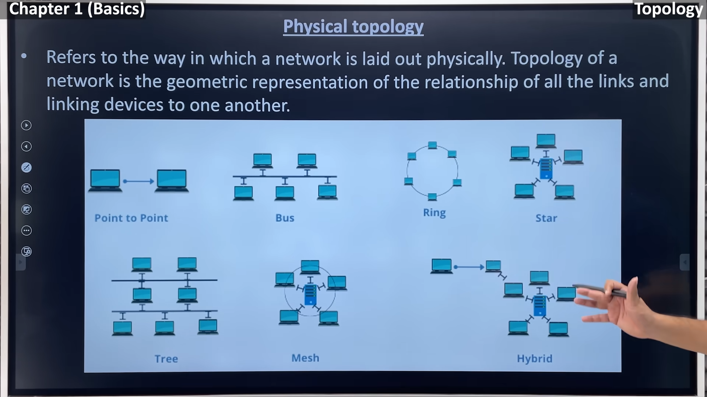
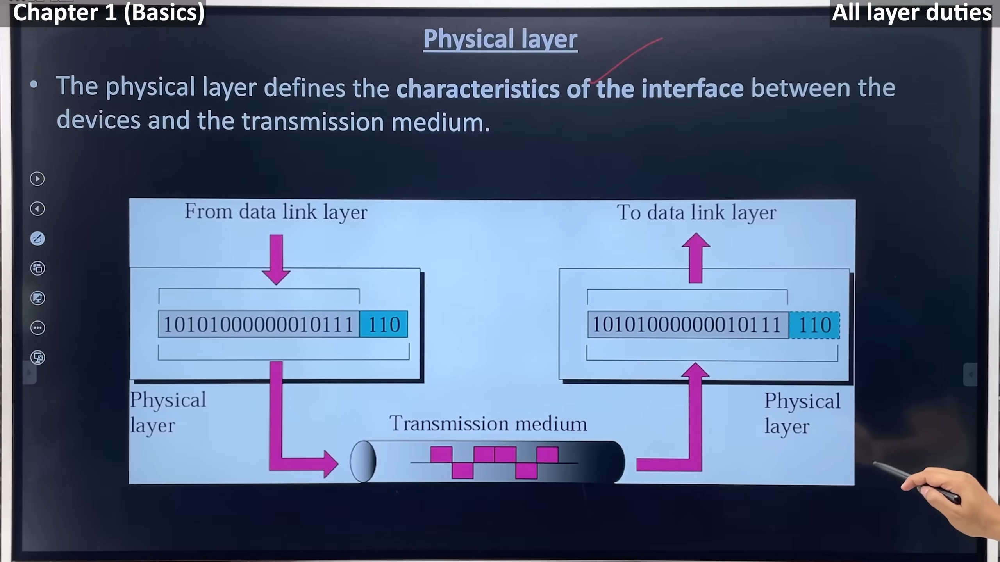

                                      Computer Network

>> The full form of computer is Common Operating Machine Purposely Used for Technological and Educational Research. 

# Computer Network
A network allows devices to exchange data using wired or wireless connection

* Sender
* Reciver
* Message
* Trasmission medium
* Protocol

## Transmission Mode
1. Singlex Mode :- permanent reciver and sender eg:- pagger
2. half duplex Mode :- receiver and send both but once at a time  eg:- vokitoki
3. full duplex mode :- once station can reciver and send at the same time

## type of connection
1. point-to-point :- 2 device connected diretly
2. multipoint:- a share medium help device to connect each other

### topology
* point to point 
* bus
* ring
* star
* tree
* mesh 
* hybrid
 

LAN :- localarea network
MAN :_ metropolitan area network
WAN :- wide area network

## OSI model
open system interconnection
developed by international organisation for standerization (ISO)
* application 
* presentation
* session
* transport
* netwrok
* data link
* physical

### phyical layer

