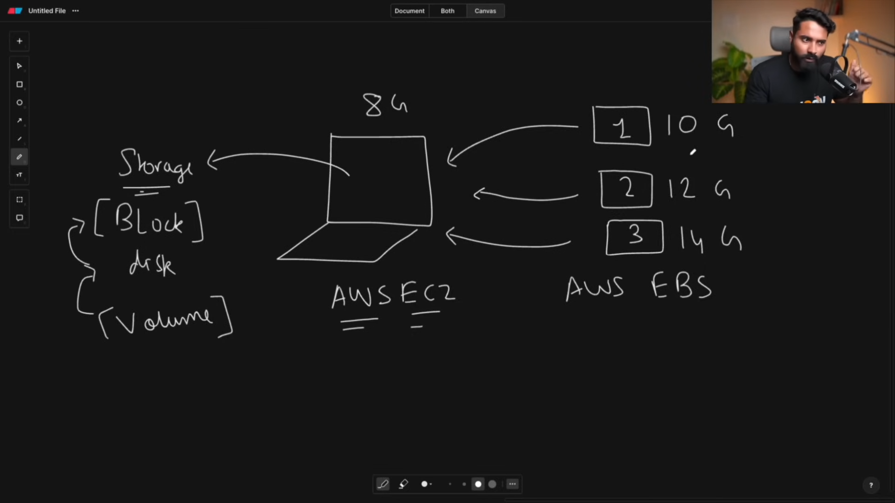
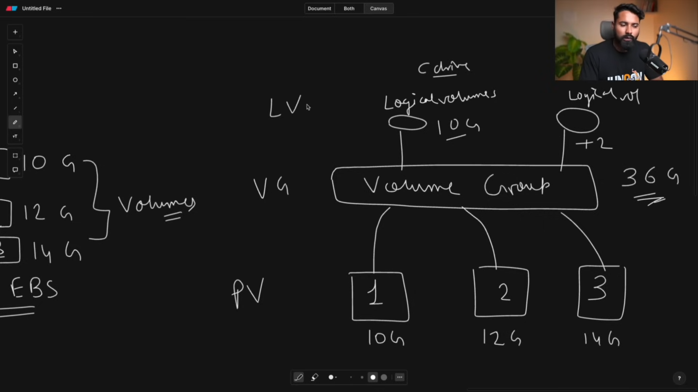

#                     Linux Operating System

## Basic understanding

> data is transfer through cables

IP ADDRESS --> ISP (Internet Service Provider ) --> Optical Fiber --> Data Center

> Server ( Server / Dilever information )
* email server
* file server
* DB server
* App server

> Client ( Request / consume  infomation )

> DNS ( WHo map / linked IP Address to Domain )

> Application vs Web Server
Application :- Dyanmic Data
Web Server :- Static Data

Web Server: Handles HTTP requests, serves static content, and forwards dynamic requests to an application server.
Application Server: Processes business logic, executes application code, and interacts with databases to generate dynamic responses.

user <--> (Apache / nginx ) <--> web server <--> Application server

> Type of Application
* Standalone Apps
Applications that run locally on a single device without needing internet connectivity.

* Web Application
Applications accessed via a web browser that typically require an internet connection. They may have both static and dynamic content.

## Linux
* Open source OS
* unix (paid eg:- MacOS) vs linux (free) 

> use linux through
* WSL
* VM
* AWS
etc

* shell ( Cmd ) >> linux kernel 
* bootloader ( GRUB ) :- run files and setup envonment to run OS  

## Linux Commands

> top 
--> The top command in Linux shows real-time system performance, including CPU, memory usage, and running processes.
--> runnning process
PS 1 is the file that run first
Procss state :- Sleeping . running , terminated , zombie
can use htop command for more user friendly

> df -h
--> disk space
--> Shows disk space usage for all mounted filesystems

> free -h
--> see ram
Displays memory (RAM) usage, including total, used, free, and swap memory

> cd
--> change directory

> cd ../
--> move back

~/ -> home 
/ -> root

bin	 --> Stores important programs like ls, cp, and rm that all users can run.
boot --> Contains files needed to start the computer, including the Linux kernel.
dev	 --> Stores special files that represent hardware (like USBs, hard drives).
etc	 --> Holds system settings and configuration files (like network settings).
home --> Each user's personal folder (e.g., /home/user).
lib, lib32, lib64 --> Stores libraries that programs need to run. (Like DLL files in Windows).
media --> Where USBs and CDs get mounted when inserted.
mnt	  --> A folder used to temporarily attach external drives.
opt -->	Used for optional software (programs installed manually).
proc --> A virtual folder with live system information (like CPU and memory usage).
run	 --> Stores temporary system processes and runtime data.
tmp --> A temporary storage space (files here are deleted on reboot).
usr --> Stores user programs and files (/usr/bin/ contains most applications).
var --> Holds logs, temporary files, and caches (like history of system events).

> cd /
--> go to root folder

> ls

> cd /var/logs
--> all logs

> cd Users
--> show users

> date
--> show todat date

> mkdir
--> create directory

> pwd
--> Show present directory path

> touch eg:- touch file.txt
--> create a file

> rm , rmdir
--> delete file and folder 
-r: The -r (or --recursive) flag tells rm to delete the directory and all its subdirectories and files, recursively.

> cat file name
--> show data inside file

> echo "hello dosto" > demofile.txt
--> print data in a file , id file is not exist it create  a file and add that text

> zcat file name
--> see inside zip file

> head myfile.txt
--> print top 5 file

> tail myfile.txt
--> print last 5 line

> tail -f nmyfile.txt
--> show update data live

> less and more file.txt
--> show large file data
less show all and does not close automatically
more show page by page and close at end

> cp source_filename destination_file_name
--> copy one file data to another file

> cp -r source_folder destination_folder
--> copy data from directory to destination folder

> mv souce_file  detination file
--> move a file and rename a directory and file

> wc ( word count ) filename
--> show line words size_of_file_in_bytes myfile.txt
can work with 1 or more file

> soft and hard links
--> ln -s file_name destination (soft link)
--> ln file_name destination (hard link)

> cut -b 1-4 filename.txt
--> show words from index

> echo "Hello World Linux" | cut -d ' ' -f 1-2
-d ' ' → Uses space as the delimiter (separator between words).
-f 1-2 → Selects the first and second words.

> echo "hello" | tee
> echo "hello" | tee hello.txt
--> use to put on screen or in file 

> sort filename.txt
--> sort text

> diff file_name file_2
--> difference between file

can not differe more than 2 file

> vi (editor)
vi file.txt > i > esc > :wq > enter

--> | (Pipe) → Passes output of one command to another.
Example: ls -l | grep ".txt" (Filters .txt files from the list)

--> > (Redirection) → Redirects output to a file (overwrites).
Example: ls -l > output.txt (Saves output to output.txt)

--> >> (Append Redirection) → Redirects output to a file (appends).
Example: ls -l >> output.txt (Adds output to output.txt without overwriting)

## connect one linux to another

ssh
secure shell generate a private key

> ssh -i privatekeypath ubuntu@ce2address
--> connnect ec2 server on out plateform

sudo apt-get install openssh-server
sudo service ssh start

ssh-keygen -t rsa
ssh-copy-id username@SystemB_IP

Find System B's IP Address: Get the IP address of System B using ifconfig or ip addr.

ssh username@SystemB_IP

> df ( disk usage )

> du (know about specific folder )
du  .

> ls -a 

> fuser (  )

> kill -9 processiD

> free 

> nohup ( save logs / save output of any command )
nohup free -h

head -n 5 nohup.out

> vmstart ( memory / cache )

## System level command

> uname ( what platform )
output ubuntu

> uptime ( time from system running )

> who (list of user and when login)

> whoami ( user name )

> python --version ( check version )

> which bash ( location / version  of command , package )
which cp

> id 

> sudo (super user do)

> cat /etc/passwd  ( for users )
> cat /etc/group ( for group )

> sudo shutdown ( shutdowm )

> sudo reboot

> apt ( application package manager )
sudo apt install docker.io ( look socker in systme )
sudo apt-get install docker.io ( get from internet )
* redhat -> rpm
* fedora -> dnf
* ubuntu -> apt

## User and group management commands

>> useradd -m user_name
-m ( add and make a directory ) ( if not use -m user created but not added )

give user a password
> sudo passwd jethalal 
add new password

> su username 
this switch user

> exist ( to do back from user )

> sudo userdel username (delete user)

> sudo groupadd deveps ( crate a group )

> sudo gpasswd -a -M  user1,uername groupname (add user to group )

-a add
-M multiple users

> sudo groupdel groupname ( delete group name ) (this donot delete user inside this group )

## file permission commands

> ls -l tp see permission

dtwxrwxr-x
user -> group -> others users
r->read
w->write
x->execute

* ---   0
* --x   1
* -w-   2
* -wx   3
* r--   4
* r-x   5
* rw-   6
* rwx   7

> chmod 777 file/foldername
chmod 700 file_name

> umask  ( it is a 4 digit number , that show what permission will be given to new file or folder when created )

> cat .bashrc ( bash config )

> sudo chown username filename
( change ownership ) 

> sudo chgrp group filename
( chaneg group permission )

--> compress zip
> sudp apt zip

> zip -r zip_file_name filename  
-r recursively for folder

> unzip filename to unzip a file

> gunzip (zip) gzip (unzip) same as above

> tar untar ( also do same but it need some flags)
tar -cvzf filename.tar.gz  filename
tar -xvzf compressfilename 
f -> file 
c -> compress
x ->  extract
v ->  verbose
z ->  use gunzip tar.gz

## transfer a file to remote
--> to send
scp -i  pathtoprivatekeyfile filename remote_url:where to save 

--> to get
scp -i  pathtoprivatekeyfile remote_url:what_file   where

--> remote sync
apt rsync 
rsync -e "ssh -i pathtoprivatekey" -avz filename remote_url:path

same as scp but better

## Networking Commands

> ping domain

this chekc whether an domain/server is uprunning by sending some data and recieved data

> sudo apt net-tools
> netstat
> ifconfig
> traceroute domain/server
tells the route / path of data flow
> trancepath domain/server
> mtr domain/server to use ping and tracepath togather
my trace route
> nslookup domain/server
80 , 8080 fror http and 443 for https 

> telnet
> hostname tells ip of this 
hostname anydomain/server

/etc/host

> whois domain/server
deepth details 

> curl and wget
to get response from a server and wget to download 

sudo apt install jq
curl -X GET endpoint | jq
wget endpoint

> iptables

> watch mtr
will check/call after 2 secs

> nmap 
network map simillar to traceroute

> route 
change route

## Pro linux command 
>> awk 
programming in linux is done by shell scripting but if donot want to code we can use awk

> work on csv , tsv , structure data , comma seperated data

* awk '{print}' file_name --> to print file

* awk '{print $1}' file_name --> to print  column 1
awk '{print $1,$2}' file_name --> to print  column 1,2

* awk '/INFO/ {print $1,$2}' file_name --> to print  column 1,2

* awk '/INFO/ {print $1,$2}' file_name > filename --> to print  column 1,2 and print in another file

* awk '/INFO/ {count++} END {print count}' file_name --> to print  count and print

* awk '/INFO/ {count++} END {print "string",count}' file_name --> to print  count and print

* awk '$2 >= "08:55" && $2 <= "08:55" {print $2,$3,$4}' file_name

* awk '$2 >= "08:55" && $2 <= "08:55" {print NR}' file_name
print no of rows

>> SED ( Stream editor )
have to right expression
> sed '/INFO/p' filename
use -n for exacct match
p for print

> sed 's/INFO/LOG/g` filename
this change INFO to LOG
s for substring 
g global 

> sed -n -e '/INFO/=' app.log
this print line number where this exist 

> sed -n -e '/INFO/=' -e '/INFO/p' app.log
this print line number where this exist 
and print that

> sed '1,10 s/INFO/LOG/g' filename
done operation in range

>> GREP
global regular expresion pattern

> grep INFO app.log
> grep -i info filename
-i for case insensitive

> grep -i -c info app.log
count

> awk '/INFO/ {count++} END {print count}' filename

## Linux Volume Management

list the blocks
> lsblk
show all block 
> df -h 
show storage and availabel directory

--> EBS
snapshot is the backup of an volume , it comes when we create block in EBS

after creating -> attached -> give instance (EC2) -> device name /dev/sdf
f g h ...

--> Physical vs logical vs volume groups in linux 

;

--> LVM logical volume manager :- manage physical , logical , volume groups

> sudo su to become root user
> sudo lvm

> pvs physical volumes
volumes -> physical volumes

> pvcreate /dev/xvdf /dev/xvdg /dev/xvdh 

this create physical volumes

> vgcreate tws_vg (volume group) /dev/svdf /dev/xvdg
 this create volume group of 2 physical volume 
> vgdispaly
> lvdisplay

> pvdisplay
this print / show about all physical volumes

> vgs
to know about physical volume

> lvcreate -L 10G -n tws_lv tws_vg

-L size 

to create a logical volume from voulme groups

##### mount volume and lvm 

> lvs
show lv

to mount
> mkdir /mnt/tws_lv_mount
> mkfd.ext4 /dev/tws_vg/tws_lv
to format lv
> mount /dev/tws_vg/tws_lv /mnt/tws_lv_mount

this mount to source

> unmount /mnt/tws_lv_mount
this unmout this volume

##### EBS , mount physical volume

xvdh direct mount

> mkdir /mnt/tws_disk_mount

> mkfs -t ext4 /dev/xvdh
format disk

> mount /dev/xvdh /mnt/tws_disk_mount/
to mount

logical volumes and physical volume mount and anmount above

#####  Dynamic storage management
 extend logical storage size

 > lvextend -L +5G /dev/tws_vg/tws_lv