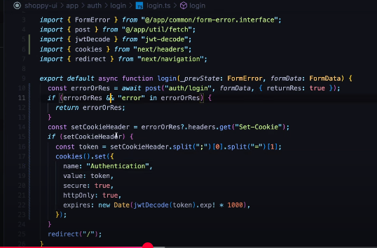
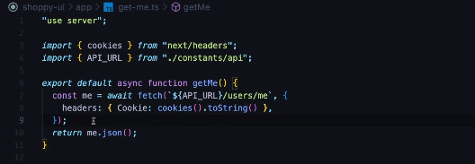

# Nest js

## Relation And Populate

##### In node js

staff_id:{
type:mongoose.Schema.TYpes.ObjectId,
ref:"Staff"
}

().populate("staff_id)

#### Path and Math

staff_id:[{
type:mongoose.Schema.TYpes.ObjectId,
ref:"Staff"
}}

.populate({
path:"staf_id",
match:{
name:"Sachin",
email:"sachin@gmail.com"
}
})

--> use like

```js
.populate({
path:"staf_id",
match:{
email:{
$regex:
}
}
})

{
$eq:""
}


{
$ne:""
}
```

#### Sorting & Limit

```js
.populate({
path:"staf_id",
select:"-_id name",
options:{
    sort:{ name:"-1"}
    limit:2
}
})
```

#### Nested Pupulation

auth -> post -> comments

```js
find({naem:"sachin}).populate({
path:"Post",
populate:{
path:"comments
populate:{
path:"comments
}
}
})  
```

## Cookie Based authentication with passport jwt

>> npm i --save cookie-parser passport possport-jwt @nestjs/passport

>> npm i   --save-dev @types/passport-jwt @types/cookie-parser

```js
in main.ts
- import * as cookieParser from "cookie-parser"
  app.use(cookieParser())
```

- create auth module

```js
jwtstrategy.ts

import {ExtractJwt,Strategy} from "passport-jwt";
import {PassportStrategy} from "@nestjs/passport";
import {Request as RequestType } from "express";
import { Injectable } from "@nestjs/common";


export const JwtSecretTMP="secretKey"
@Injectable()
export class JwtStrategy extends PassportStrategy(Strategy){
    constructor(){
        super({
            jwtFromRequest:ExtractJwt.fromExtractors([jwtStrategy.extractJWT,ExtractJwt.fromAuthHeaderAsBearerToken()]),
            ignoreExpiration:false,
            secretOrKey:JwtSecretTMP
        })
    }
// jwtStrategy.extractJWT this will call the below function if this function does  not execist it use next things ExtractJwt.fromAuthHeaderAsBearerToken() get access from header
private static extractJwt(req:RequestType):string|null{
    if(req.cookies&&"user_token" in req.cookies && req.cookies.user_token.length>0){

        return req.cookies.user.token;
    }
    return null
}

async validate(payload:any){
    return {user:payload.id};
}

}

```

npm i --save @nestjs/jwt

```js
in auth module.ts
import {JwtModule} from "@nestjs/jwt";
import {PassportModule} from "@nestjs/passport"
imports:[PassportMOdule.register({defaultStrategy:"jwt",session:false}),
JwtModule.register({secret:JwtSecretTMP,signOptionIN:"1h"})

]
providers:[JwtStrategy],
controller:[AuthController]

```

```js
guard;

@Injectable()
export class JwtGuard extends AuthGuard("jwt") {}
```

```js
@UseGuard(JwtGuard)
@COntroller()


```

```js
// auth controller
import {JwtService} from "@nestjs/jwt"
@COntroller("auth")
export class AuthController{

    constructor(private jwtService:JwtService){}

    @Get()
    async login(@Res({passthrough:true}  res) ){
        const payload={usernam:"john",id:1};
        // return {
        //     access_token:this.jwtService.sign(payload)
        // }
        // or

        res.cookie("user_token",this.jwtService.sign(payload),{
            expires:new Date(Date.now()+3600000),
        });

           res.cookie("user_token",this.jwtService.sign(payload),{
            secure:true,
            httpOnly:true,
            expires:new Date(Date.now()+3600000),
        });
        return {}
    }

    @Get("lagout")
    async lagout(@Res({passthrough:true}) res)
    res.cookie("user_token","",{express:new Date(Date.now())});
    return {}
}

```

in nest js






## AUthentication and authorization using JWT in nestjs
